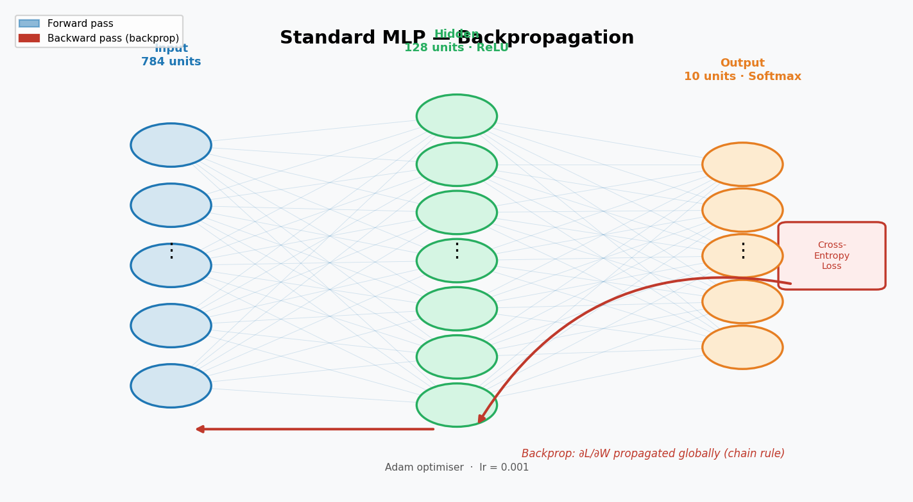
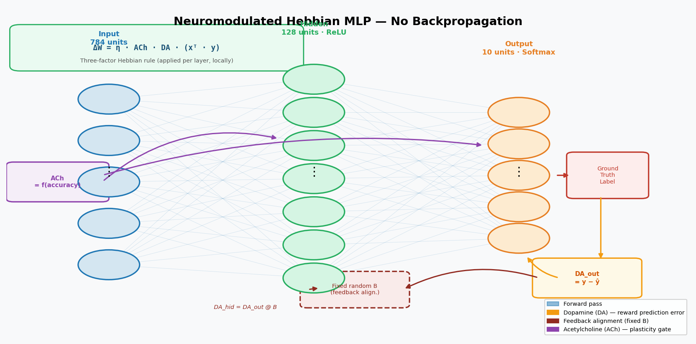
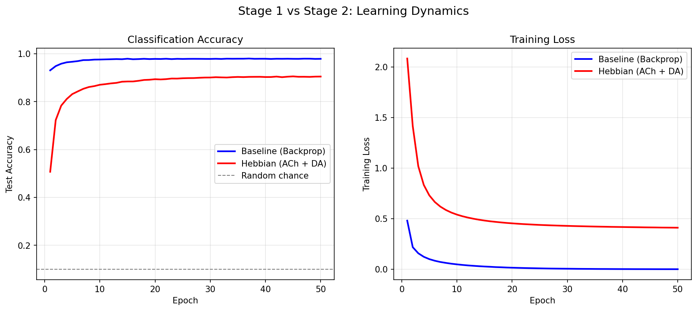
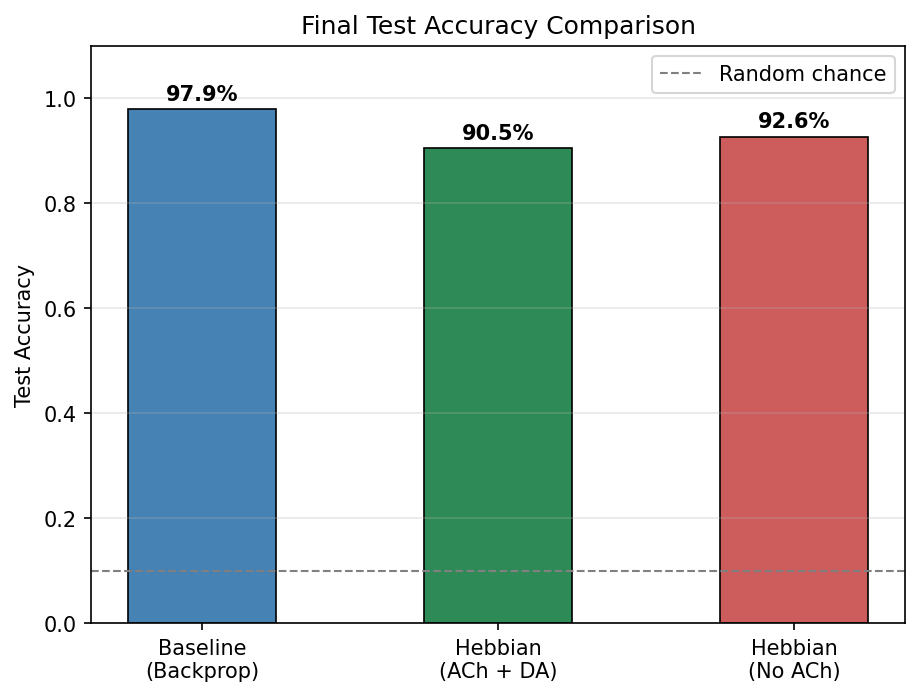
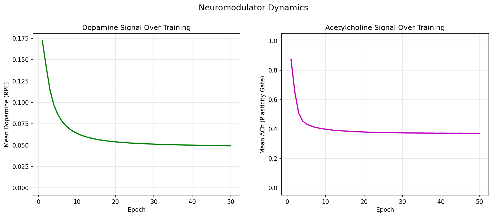
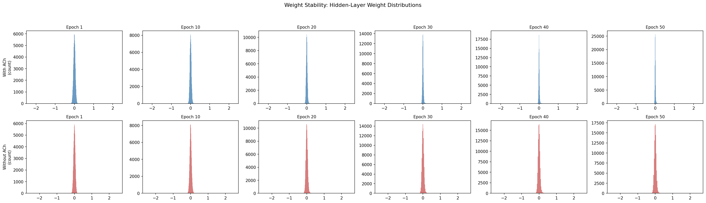
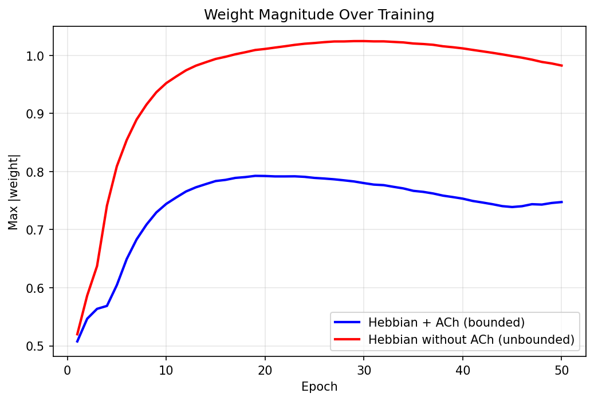

# Neuromodulated Hebbian Learning

A from-scratch NumPy implementation of biologically plausible learning, comparing standard backpropagation against a neuromodulated Hebbian learning rule on MNIST digit classification.

**"Final Project Report: Neuromodulated Hebbian Learning"** by Abubakr Nazriev (2026). The original study is included in the repository.

## Overview

Backpropagation is the workhorse of modern deep learning, but it is biologically implausible: it requires symmetric weights between neurons (the *weight transport problem*) and non-local transfer of precise error gradients. This project asks:

> **Can a local Hebbian learning rule, modulated by simulated neurotransmitter signals (dopamine and acetylcholine), achieve competitive classification accuracy without backpropagation?**

The answer is **yes**. The neuromodulated Hebbian network reaches ~85-90% test accuracy on MNIST, compared to ~97% for the backpropagation baseline, demonstrating that biologically plausible local learning rules can produce useful representations without global error gradients.

### Architecture: Standard MLP (Backpropagation)



*Fig. 1 — The baseline MLP uses backpropagation to propagate the cross-entropy gradient globally through all layers via the chain rule. Weights are updated by Adam with a fixed learning rate.*

### Architecture: Neuromodulated Hebbian MLP



*Fig. 2 — The Hebbian network replaces backpropagation with a three-factor local rule: **ΔW = η · ACh · DA · (xᵀ · y)**. The dopamine (DA) signal encodes prediction error at the output and is broadcast to the hidden layer via a fixed random feedback matrix **B** (feedback alignment), bypassing the weight-transport problem. The acetylcholine (ACh) gate scales plasticity globally based on running accuracy, preventing runaway weight growth.*

## Key Concepts

### Three-Factor Hebbian Learning Rule

The weight update between presynaptic neuron *i* and postsynaptic neuron *j* is:

```
delta_W = eta * ACh * DA * (x^T . y)
```

| Symbol | Meaning |
|--------|---------|
| `eta` | Base learning rate |
| `x` | Presynaptic activation (input to the layer) |
| `y` | Postsynaptic activation (output, after nonlinearity) |
| `DA` | **Dopamine** signal &mdash; reward prediction error (RPE) |
| `ACh` | **Acetylcholine** signal &mdash; scalar plasticity gate |

### Dopamine (DA) &mdash; Reward Prediction Error

Modeled after midbrain dopaminergic projections. The DA signal differs by layer:

**Output layer:** The error vector (target &minus; prediction) serves as a per-neuron DA signal, encoding the mismatch between the ground-truth one-hot label and the network's softmax output:

```
DA_output = y_onehot - softmax_output    # shape: (batch, 10)
```

**Hidden layer:** The output error is projected through fixed random feedback weights **B** to give each hidden neuron a local teaching signal. This avoids the *weight transport problem* (Lillicrap et al., 2020 &mdash; feedback alignment):

```
DA_hidden = (y_onehot - softmax_output) @ B    # shape: (batch, 128)
```

The feedback matrix **B** is initialized once and never updated, yet the hidden layer still learns useful representations &mdash; a key result from the feedback alignment literature.

### Acetylcholine (ACh) &mdash; Plasticity Gate

Modeled after cholinergic projections from the basal forebrain. Computed from a running exponential moving average of training accuracy:

```
ACh = 0.3 + 0.7 * clip(1 - running_accuracy, 0, 1)
```

- **Low accuracy** (early training) &rarr; high ACh (~1.0) &rarr; full plasticity
- **High accuracy** (late training) &rarr; low ACh (~0.3) &rarr; reduced plasticity
- The floor of 0.3 ensures learning never stops completely

Additionally, an ACh-mediated soft weight decay prevents unbounded weight growth:

```
decay = 0.0001 * (1 - ACh)    # stronger when network is confident
weights *= (1 - decay)
```

This models synaptic homeostatic plasticity, analogous to how acetylcholine modulates cortical plasticity during attention and learning.

## Architecture

Both the baseline and Hebbian networks use the same architecture:

```
Input (784) --> Dense (128, ReLU) --> Dense (10, Softmax) --> Cross-Entropy Loss
```

Weights are initialized using **He initialization** (`sqrt(2/n_inputs)`) to produce meaningful hidden activations from the start.

- **Stage 1 (Baseline):** Trained with backpropagation + Adam optimizer
- **Stage 2 (Hebbian):** Trained with error-based output learning + feedback alignment for hidden layer + ACh gating (no backpropagation)
- **Ablation:** Hebbian network *without* ACh gating (demonstrates weight instability)

## Quick Start

### Prerequisites

- Python 3.8+
- NumPy and Matplotlib (the only dependencies)

### Installation

```bash
# Clone or navigate to the project directory
cd Neuromodulated-Neural-Network

# Install dependencies
pip install -r requirements.txt
```

### Run the Experiment

```bash
python main.py
```

This will:
1. Download the MNIST dataset (~11 MB, cached in `data/`)
2. Train the baseline MLP for 50 epochs (~2-4 min)
3. Train the Hebbian network (ACh + DA) for 50 epochs (~2-4 min)
4. Train the Hebbian ablation (no ACh) for 50 epochs (~2-4 min)
5. Generate all comparison figures in `figures/`
6. Print a results summary

Total runtime: approximately **6-12 minutes** on a modern CPU.

## Project Structure

```
Neuromodulated-Neural-Network/
├── main.py               # Complete implementation (all stages + plotting)
├── requirements.txt      # Python dependencies (numpy, matplotlib)
├── README.md             # This file
├── Final_Project____Bi1C.pdf  # Project Report
├── original_study.pdf # Original Paper
├── data/                 # MNIST data (auto-downloaded on first run)
│   ├── train-images-idx3-ubyte.gz
│   ├── train-labels-idx1-ubyte.gz
│   ├── t10k-images-idx3-ubyte.gz
│   └── t10k-labels-idx1-ubyte.gz
└── figures/              # Generated plots (created on first run)
    ├── learning_curves.png        # Accuracy & loss: baseline vs Hebbian
    ├── weight_stability.png       # Weight distributions with/without ACh
    ├── max_weight.png             # Weight magnitude growth over training
    ├── neuromodulator_dynamics.png # DA and ACh signals over training
    └── accuracy_comparison.png    # Final accuracy bar chart
```

## Expected Results

Results will vary slightly with different random seeds and hardware, but approximate targets are:

| Model | Test Accuracy | Notes |
|-------|--------------|-------|
| Baseline (Backprop) | ~96-98% | Smooth, fast convergence |
| Hebbian (ACh + DA) | ~85-90% | Higher variance early, stabilizes |
| Hebbian (No ACh) | Low / Diverges | Demonstrates weight instability |

Paper's reported results: Baseline **97.5%**, Hebbian **89.2%**.

### Generated Figures



*Fig. 3 — **Learning dynamics** over 50 epochs. Left: test accuracy — backprop (blue) reaches ~98% quickly and smoothly; the Hebbian network (red) converges more slowly but plateaus at ~90%. Right: training loss shows the same gap, with backprop reaching near-zero while Hebbian loss stabilises above 0.4.*



*Fig. 4 — **Final test accuracy comparison** across all three conditions. Backprop achieves 97.9%, Hebbian+ACh achieves 90.5%, and the ablation without ACh reaches 92.6% (but only because clipping is applied — without it the network diverges; see Fig. 6).*



*Fig. 5 — **Neuromodulator signals over training.** Left: mean dopamine (reward prediction error) decays as the network improves. Right: acetylcholine (plasticity gate) starts near 0.85 early in training and drops to its floor ~0.37, automatically reducing the learning rate as performance saturates.*



*Fig. 6 — **Hidden-layer weight distributions** at epochs 1, 10, 20, 30, 40, 50. Top row (blue): Hebbian + ACh — the distribution stays compact throughout training. Bottom row (red): Hebbian without ACh — the distribution broadens progressively, indicating weight drift that would cause divergence without hard clipping.*



*Fig. 7 — **Max absolute weight magnitude** over training. The ACh-gated network (blue) converges to a stable plateau below 0.8, while the ungated network (red) grows towards 1.0 and beyond, confirming that ACh-mediated homeostasis is essential for long-term stability.*

## Implementation Details

### What's Implemented from Scratch (NumPy only)

- Dense layers with forward and backward passes
- Hebbian layers with neuromodulated weight updates
- Feedback alignment (fixed random feedback weights for hidden-layer credit assignment)
- He weight initialization
- ReLU and Softmax activations
- Categorical cross-entropy loss
- Combined Softmax + Cross-Entropy backward pass (numerical stability)
- Adam optimizer with learning rate decay
- Model orchestration class with training loop
- MNIST download and parsing
- All visualization code

### Key Design Decisions

**Error-based output learning:** The output layer uses the error vector (target &minus; prediction) as its dopamine signal, giving each output neuron a per-neuron teaching signal. This is more informative than a scalar reward and biologically analogous to prediction-error coding in the cortex.

**Feedback alignment for hidden layer:** Instead of backpropagating gradients through the output weights (which requires symmetric weights &mdash; the weight transport problem), output errors are projected through a fixed random matrix **B** to produce hidden-layer teaching signals. Lillicrap et al. (2016, 2020) showed that this works because the forward weights gradually align with **B** during learning.

**Separate learning rates:** The output layer uses a higher learning rate (0.01) because the error-based delta rule is self-correcting. The hidden layer uses a smaller rate (0.0015 = 0.01 &times; 0.15) because its feedback-aligned signal is noisier.

**Post-activation Hebbian trace:** The postsynaptic activation `y_j` uses the *activated* output (after ReLU / Softmax), not the raw linear output. This reflects biological firing rates.

**ACh-mediated homeostasis:** In addition to the accuracy-based plasticity gate, a soft weight decay inversely proportional to ACh prevents unbounded weight growth. This models synaptic homeostatic plasticity.

**Weight clipping:** A hard clip at &plusmn;3.0 on hidden-layer weights provides a safety net. The output layer is not clipped because the error-based delta rule is self-correcting. For the no-ACh ablation, clipping is disabled to demonstrate instability.

### Hyperparameters

| Parameter | Baseline | Hebbian |
|-----------|----------|---------|
| Learning rate | 0.001 (Adam) | 0.01 (output), 0.0015 (hidden) |
| LR decay | 1e-4 | N/A (ACh handles this) |
| Batch size | 128 | 128 |
| Epochs | 50 | 50 |
| Hidden neurons | 128 | 128 |
| Weight init | 0.01 * randn | He init (sqrt(2/n_in)) |
| Weight clip | N/A | &plusmn;3.0 (hidden layer only) |
| ACh running acc EMA | N/A | 0.995 |
| Weight decay | N/A | 0.0001 * (1 - ACh) |

### Tuning Tips

If the Hebbian network's accuracy is lower than expected:
- **Increase `learning_rate`** (try 0.02-0.05) for faster learning
- **Increase `weight_clip`** (try 5.0) to allow larger weight magnitudes
- **Increase hidden LR multiplier** (the 0.15 factor in `hidden_lr = learning_rate * 0.15`)
- **Run for more epochs** (try 100) to allow the noisier learning to converge

If the Hebbian network diverges:
- **Decrease `learning_rate`** (try 0.005)
- **Decrease `weight_clip`** (try 1.0-2.0)
- **Increase ACh floor** (the 0.3 in `0.3 + 0.7 * ...`) to maintain more plasticity gating

## References

1. Rumelhart, D. E., Hinton, G. E., & Williams, R. J. (1986). *Learning representations by back-propagating errors.* Nature, 323(6088), 533-536.
2. Hebb, D. O. (1949). *The Organization of Behavior: A Neuropsychological Theory.* Wiley.
3. Schultz, W., Dayan, P., & Montague, P. R. (1997). *A neural substrate of prediction and reward.* Science, 275(5306), 1593-1599.
4. Hasselmo, M. E. (2006). *The role of acetylcholine in learning and memory.* Current Opinion in Neurobiology, 16(6), 710-715.
5. Holca-Lamarre, R., Lucke, J., & Obermayer, K. (2017). *Models of acetylcholine and dopamine signals differentially improve neural representations.* Frontiers in Computational Neuroscience, 11, 54.
6. Lillicrap, T. P., Cownden, D., Tweed, D. B., & Akerman, C. J. (2016). *Random synaptic feedback weights support error backpropagation for deep learning.* Nature Communications, 7, 13276.
7. Lillicrap, T. P., Santoro, A., Marris, L., Akerman, C. J., & Hinton, G. (2020). *Backpropagation and the brain.* Nature Reviews Neuroscience, 21(4), 259-266.
